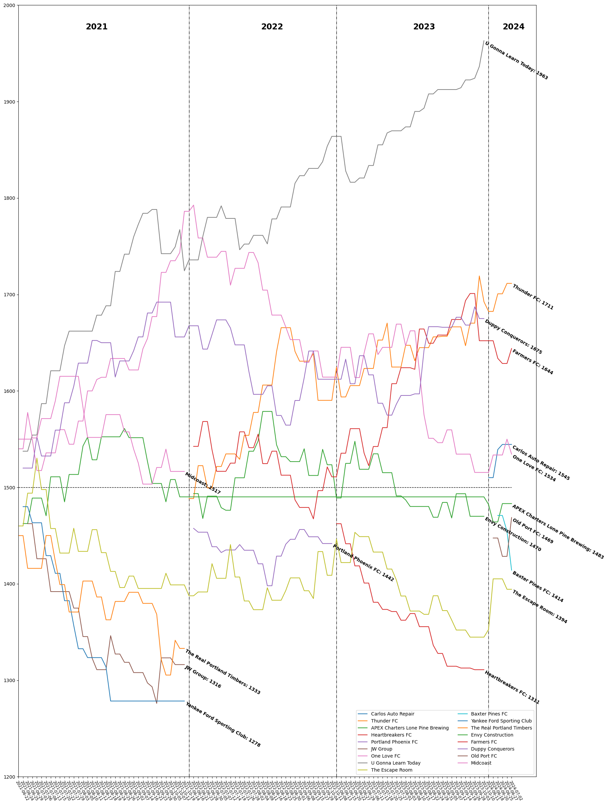

# SMUSL-STATS
The statistics for the clubs playing in Southern Maine United Soccer League (SMUSL) from 2021 to today.
The statistics includes:
- Elo rating
- Match odd (Win/Draw/Lose)
- Biggest upset
- Most Unexpected
- and to be added more..

  <button class="tablinks" onclick="openTeam(event, 'General')">General</button>
  <button class="tablinks" onclick="openTeam(event, 'Thunder FC')">Thunder FC</button>
  <button class="tablinks" onclick="openTeam(event, 'Lone Pine')">Lone Pine</button>

<!-- Tab content -->

    
    

    

    

# Reference
[1]Wikipedia Contributors, “Elo rating system,” Wikipedia, Apr. 02, 2019. https://en.wikipedia.org/wiki/Elo_rating_system (accessed Jul. 5, 2024).

‌[2]Wikipedia Contributors, “World Football Elo Ratings,” Wikipedia, Apr. 04, 2019. https://en.wikipedia.org/wiki/World_Football_Elo_Ratings (accessed Jul. 5, 2024).

‌[3]François Labelle, “Elo Win Probability Calculator,” wismuth.com. https://wismuth.com/elo/calculator.html#system=fide (accessed Jul. 05, 2024).

‌[4]“World Football Elo Ratings,” www.eloratings.net. https://www.eloratings.net/ (accessed Jul. 05, 2024).

‌[5]Lars Schiefler, “Football Club Elo Ratings,” clubelo.com. http://clubelo.com/ (accessed Jul. 05, 2024).

# Data Source
[6]“Home,” SMUSL. https://www.smusl.com/ (accessed Jul. 05, 2024).
[‌7]“League and Tournament Scheduler by LeagueLobster,” scheduler.leaguelobster.com. https://scheduler.leaguelobster.com (accessed Jul. 05, 2024).
‌
‌